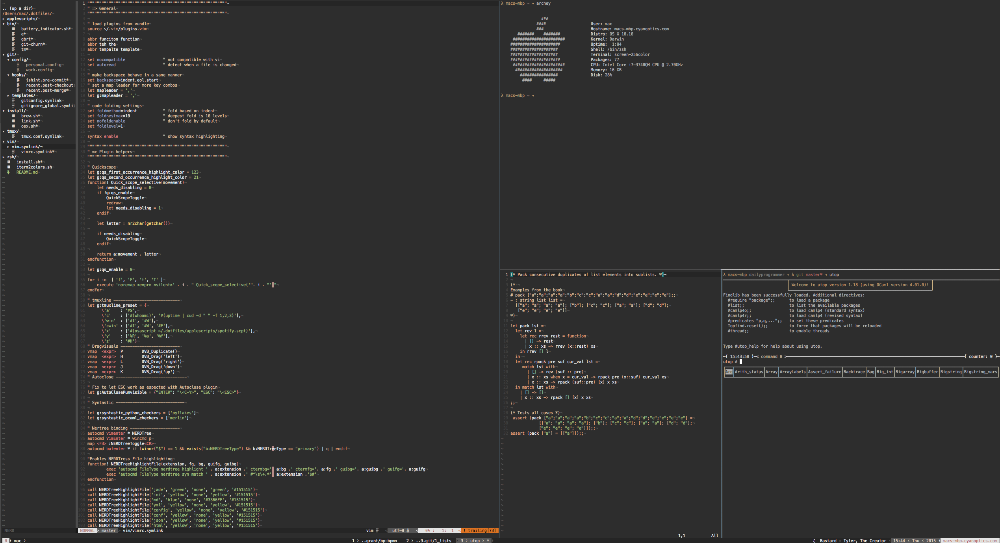

# Dotfiles

Have some dots :point_right: . . . 

## Contents

+ zsh configuration
+ vim configuration
+ tmux configuration
+ git configuration
+ osx configuration
+ Homebrew files (Brewfile.sh)

## Install

1. `git clone https://github.com/CharlieMartell/dotfiles.git ~/.dotfiles`
1. `cd ~/.dotfiles`
1. `./install.sh`

## ZSH Plugins

By default, the `.zshrc` file will source any file within `.dotfiles/zsh` that have the `.zsh` extension.
